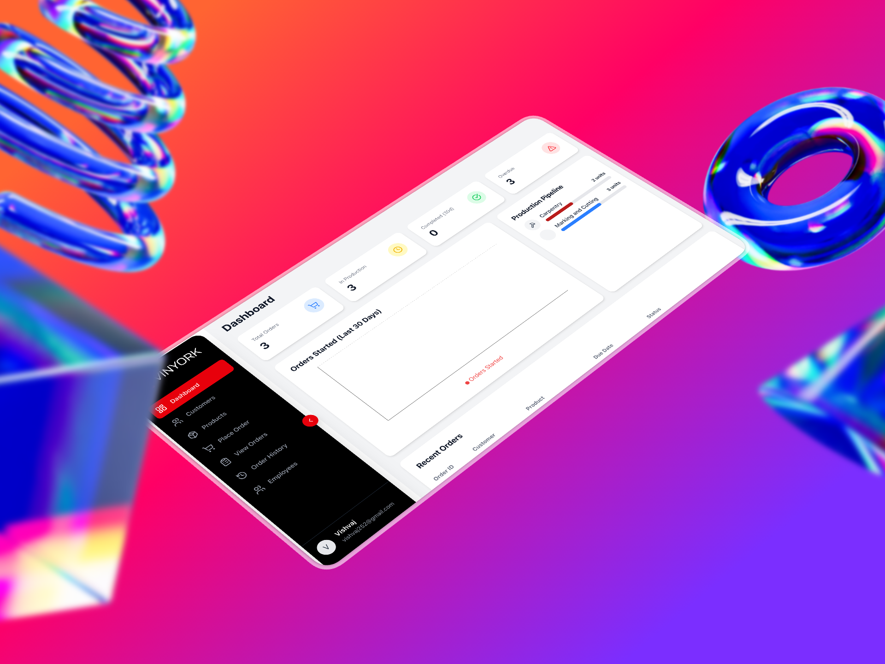
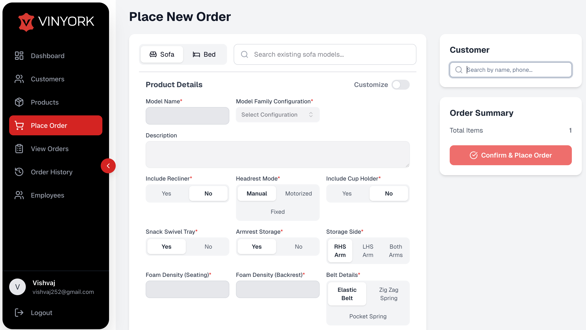
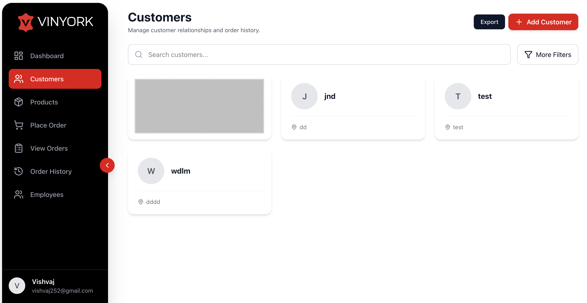
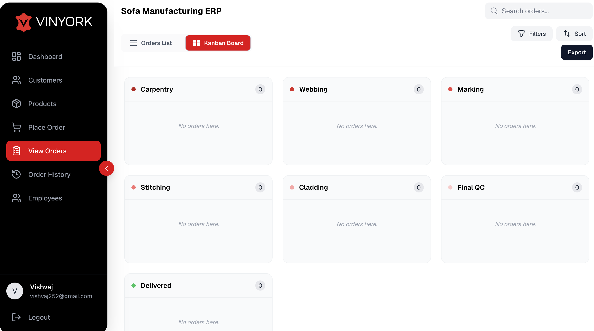
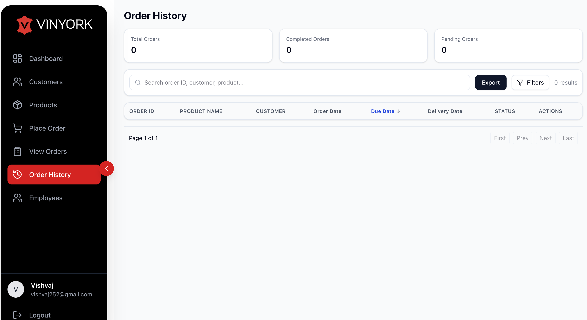

# Vinyork - Sofa Manufacturing ERP

Vinyork is a specialized Enterprise Resource Planning (ERP) system designed for the leather and sofa manufacturing industry. It streamlines the entire production lifecycle, from order customization to production pipeline tracking and inventory management.

## 🚀 Features & Screenshots

### 1. Executive Dashboard
A high-level view of the business, tracking total orders, production status, and overdue items. It features a visual production pipeline to monitor bottlenecks.


### 2. Custom Order Management
An advanced ordering interface that handles complex product configurations.
* **Detailed Customization:** Supports specific attributes like Recliner options, Headrest modes (Manual/Motorized), Cup Holders, and Foam Density.
* **Dynamic Search:** Quick lookup for existing models and customers.


### 3. Production Pipeline (Kanban)
A Kanban-style board to track orders through specific manufacturing stages:
* Carpentry -> Webbing -> Marking -> Stitching -> Cladding -> Final QC.


### 4. Customer Relationship Management (CRM)
Manage customer profiles and view their specific order histories and locations.


### 5. Order History & Tracking
Comprehensive logs of all past and current orders with filtering capabilities by date, status, and customer.


---

## 🛠 Tech Stack

* **Frontend:** React.js / Next.js
* **UI Library:** Tailwind CSS (or your specific UI library)
* **Backend:** Python / Node.js (Edit this based on your backend)
* **Database:** PostgreSQL / MongoDB

## 📦 Installation

```bash
# Clone the repository
git clone [https://github.com/yourusername/vinyork-erp.git](https://github.com/yourusername/vinyork-erp.git)

# Install dependencies
npm install

# Run the development server
npm run dev
